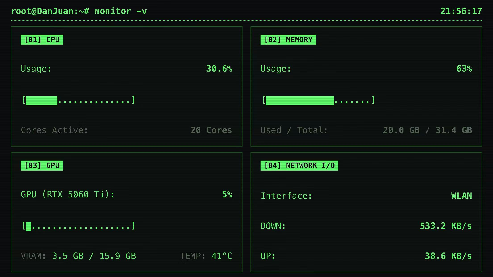
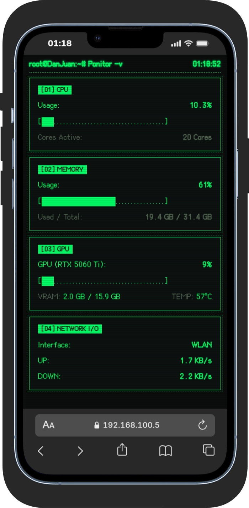
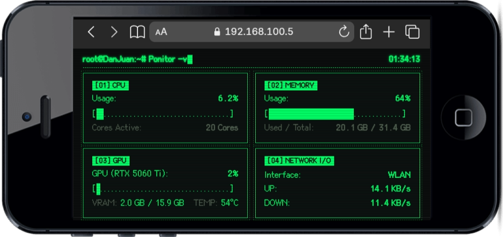

# Ponitor - 像素控制台风格的局域网性能监视器

> [English](./README-en.md)

[](https://github.com/bajibaji/Ponitor/actions/workflows/build.yml)
[](https://github.com/bajibaji/Ponitor/releases)
[](./LICENSE)
[](https://go.dev)

**像素字体 CRT 终端风格的局域网性能监视器，把旧手机变成 PC 的专属监视副屏，对宿主机性能的影响几乎可以忽略不计。**

一个 Go 编写的单二进制系统监视器，在浏览器里模拟出老式 CRT 终端的显示效果 —— 扫描线、荧光余晖、字符辉光一应俱全，实时展示 CPU、内存、GPU 和网络流量。从系统托盘静默运行，右键菜单即可切换扫描间隔和主题。

**旧手机不要丢，打开safari或者别的浏览器，变成 PC 的专属性能监视器。** 在 PC 上运行这个二进制文件，同一局域网内的旧手机打开浏览器 —— 多一块实时显示 CPU、内存、GPU、网络流量的"小屏幕"。

**软件截图：**

横屏（iPhone 7 Plus）：

<p align="center"></p>

竖屏（iPhone 13 Pro）：

<p align="center"></p>

老手机（iPhone 4 横屏）：

<p align="center"></p>

> 提示：老手机上 Safari 地址栏会占一部分高度——手指向上滑动即可隐藏地址栏，仪表盘自动铺满整屏（卡片高度自适应，无需手动设置）。

## 特点

- **纯像素风 CRT 终端** —— 内置 [Cubic 11](https://github.com/ACh-K/Cubic-11) 开源像素字体（SIL OFL 1.1），扫描线、字符辉光、闪烁光标一应俱全，手机无需安装任何字体
- **全系显卡支持** —— NVIDIA 走 `nvidia-smi`（利用率/显存/温度全量），AMD / Intel 走 PDH 性能计数器 + WMI（任务管理器同款数据源，利用率可用）
- **零依赖单二进制** —— 不装 Go、不装 Node、不装任何运行时，双击即用；前端是纯静态 HTML 直接嵌入二进制
- **对宿主性能近乎无感** —— 常驻内存 ~20 MB，空闲时 CPU 占用基本为零；默认每 2 秒唤醒采集一次，其余时间深度休眠，对宿主机日常使用毫无感知
- **手机浏览器即开即用** —— 无需安装 App，旧手机连上同一个 WiFi 打开网页就是一块专属性能监视屏
- **托盘菜单即时调参** —— 扫描间隔（0.5s/1s/2s/5s）、4 种主题、卡片高度（自适应/固定档位，适配手机横竖屏）、用户名、语言（自动跟随系统 / 中文 / English）、开机自启 右键即切，设置持久化到 `config.json`
- **自动告警** —— 使用率 >70% 黄色预警，>85% 红色告警
- **横屏自适应** —— 手机横屏自动切换 2×2 网格布局，撑满整块屏幕

### 性能占用

| 指标 | 数值 |
|------|------|
| 常驻内存 | ~20 MB |
| 空闲 CPU | ~0.01%（1s 粒度实测均值 0.007%，峰值 0.03%；每 2s 默认粒度更低，其余深度休眠） |
| 采集粒度 | 0.5s / 1s / 2s / 5s 可调 |

## 快速开始

### 1. 下载（推荐）

从 [Releases](https://github.com/bajibaji/Ponitor/releases) 下载最新的 `Ponitor_<版本>_windows_x64.exe`（或 `windows_arm` 版），直接双击运行。

### 2. 在手机上打开

- 手机连同一个 WiFi
- 浏览器访问 `http://你的PC内网IP:8080`

任务栏通知区出现托盘图标 —— 右键菜单（从上到下，语言跟随系统或手动切换）：

- **打开网页** —— 用默认浏览器打开仪表盘
- **扫描间隔** —— 0.5 秒 / 1 秒 / 2 秒 / 5 秒（即时生效，无需刷新页面）
- **主题** —— 黑绿 Matrix / 琥珀金 Amber / 赛博蓝 Cyber Blue / 黑白 Classic Mono（即时生效）
- **卡片高度** —— 自适应 (Auto，默认) / 标准 (180) / 适中 (150) / 紧凑 (110) / +10 / -10，适配手机横竖屏；Auto 按屏幕高度自动计算，一屏放下
- **用户名** —— 恢复系统用户名 / 自定义（打开设置页输入，默认显示电脑账户名）
- **语言** —— 自动（跟随系统）/ 中文 / English，切换即时生效
- **开机自启** —— 开关开机自动运行
- **作者与版本** —— 灰色只读信息（作者 DanJuan + 版本号）
- **退出**

设置持久化到 `config.json`，重启后保留。

### 3. 停止

从托盘菜单选「退出」即可。若托盘不可见（如远程桌面），在任务管理器结束 `Ponitor_*.exe` 进程亦可。

## 手动编译

```bash
# 确保已安装 Go 1.26+（Windows）
go build -ldflags="-H=windowsgui -s -w -X main.version=0.5.0" -o Ponitor_0.5.0.exe .
# 或者直接双击 rebuild.bat（自动从 git tag 取版本号生成 Ponitor_<版本>.exe）
```

启动：直接双击 `Ponitor_*.exe` 即可运行。

### 通过 GitHub Actions 编译

推送 `v*` 标签（或手动触发）即可自动编译 Windows x64 + arm 两个产物，并上传到 Release：

```bash
git tag v0.4.3
git push origin v0.4.3
```

产物命名：`Ponitor_<版本>_windows_<架构>.exe`，如 `Ponitor_v0.4.3_windows_x64.exe`（x64 / arm 两种）。

## 监控项

| 指标 | NVIDIA | AMD / Intel |
|------|--------|-------------|
| GPU 利用率 | ✅ `nvidia-smi` | ✅ PDH 性能计数器（任务管理器同款） |
| GPU 显存 / 温度 | ✅ | ❌ 无可靠来源（显示 N/A） |
| 显卡名称 | ✅ | ✅ WMI |
| CPU 使用率 / 核心数 | `gopsutil/cpu` |
| 内存使用量 / 占比 | `gopsutil/mem` |
| 网络收发速率 | `gopsutil/net` |

## 项目结构

```
├── main.go          # 后端：采集 + HTTP API + 托盘菜单
├── dashboard.html   # 前端：终端风格仪表盘（嵌入二进制）
├── hide_windows.go  # Windows：隐藏 nvidia-smi 控制台 + 打开浏览器
├── hide_other.go    # 非 Windows：空实现
├── gpu_windows.go   # Windows：GPU 采集（N 卡 nvidia-smi，其他 PDH+WMI）
├── gpu_other.go     # 非 Windows：GPU stub
├── Cubic_11.woff2   # 像素字体（SIL OFL 1.1，嵌入二进制）
├── OFL.txt          # 字体开源许可证
├── icon.ico         # 托盘图标（嵌入）
├── config.json      # 持久化设置（间隔 / 主题 / 卡片高度 / 用户名 / 语言）
├── go.mod / go.sum  # Go 模块依赖
├── .github/workflows/build.yml  # Windows CI 编译（tag v* 触发）
├── Ponitor_*.exe    # 编译产物（Ponitor_<版本>.exe）
├── rebuild.bat      # 重新编译并启动
├── README.md        # 本文件
└── README-en.md     # 英文版说明
```

## 技术栈

- **后端**: Go + [gopsutil/v4](https://github.com/shirou/gopsutil) + [getlantern/systray](https://github.com/getlantern/systray)
- **前端**: 纯 HTML/CSS/JS，零依赖，模拟 CRT 终端风格
- **API**: HTTP JSON，`/api/cpu` `/api/mem` `/api/gpu` `/api/network` `/api/config` `/api/theme` `/api/interval` `/api/cardheight` `/api/username`
- **GPU**: NVIDIA `nvidia-smi` + Windows PDH 性能计数器 + WMI

## License

本项目基于 [MIT License](./LICENSE) 开源。内置像素字体 [Cubic 11](https://github.com/ACh-K/Cubic-11) 采用 [SIL Open Font License 1.1](./OFL.txt)。
